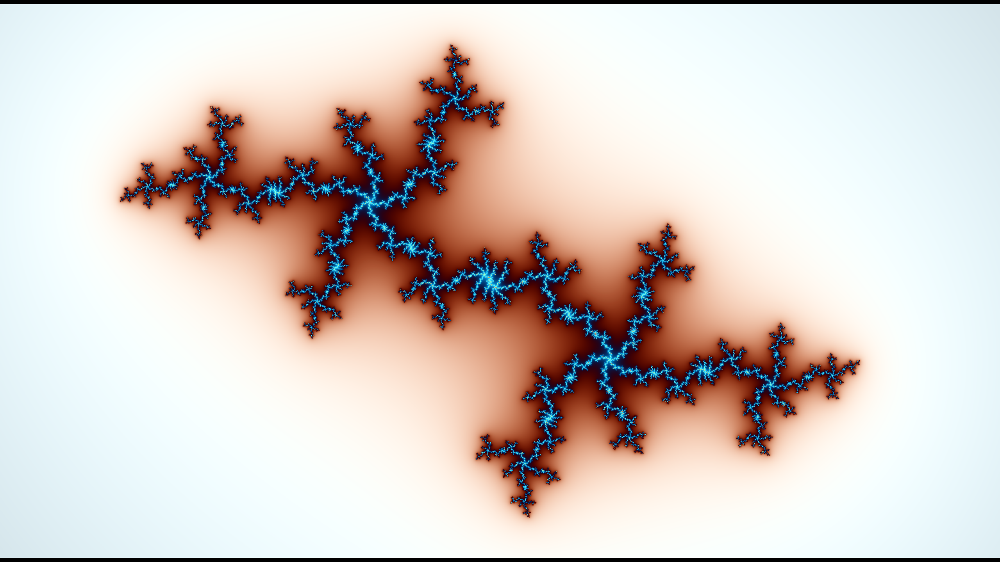

# mandelbort-explorer
A small program that for visualizing the Mandelbrot and Julia set.

# Running
Download the files and run the .exe

# Controlls
W, A, S, D - Move

Q, E - Rotate

R - Resete

O, P - Zoom / Unzoom

K, L - Increse / decrese the number of max iterations

When the Julia tick box is selected hold LEFT CTRL to pick different values with your mouse.

# Example images
Mandelbrot set

Julia set

